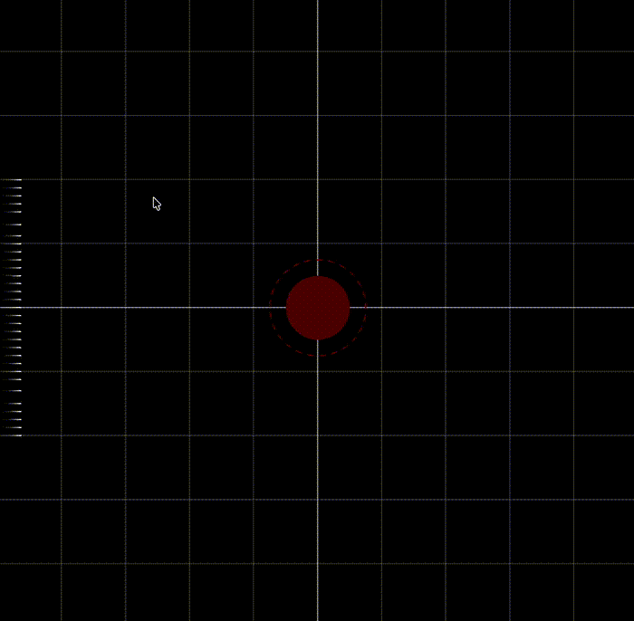
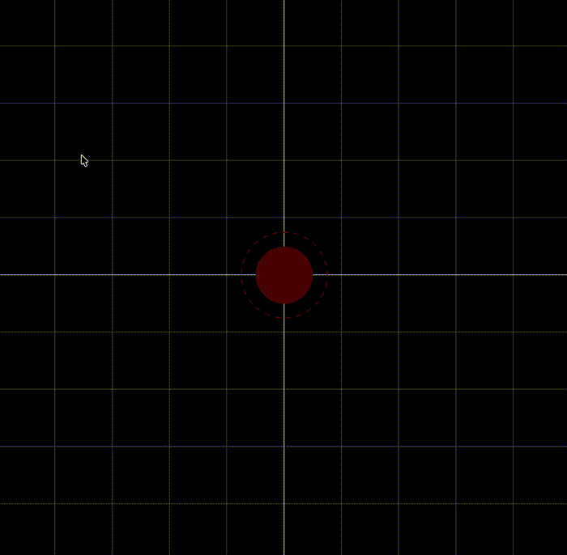

# Interactive simulation framework for photons around a Schwarzschild black hole

This project implements a modular  simulation framework for photon trajectories around a Schwarzschild black hole.

The spacetime geometry is described by the Schwarzschild line element

$$
ds^2 =
-\left(1-\frac{r_s}{r}\right)c^2dt^2
+\left(1-\frac{r_s}{r}\right)^{-1}dr^2
+r^2 d\Omega_2^2,
$$

where $r_s$ is the Schwarzschild radius (the event horizon), $c$ is the speed of light, and $d\Omega_2$ denotes the angular element on the equatorial plane.

The simulation code numerically evolves null geodesics restricted to the equatorial plane of the Schwarzschild geometry and visualises the resulting photon trajectories in real time.

Due to the symmetries of the Schwarzschild spacetime, geodesics can be reduced to a system of first-order differential equations. However, rather than integrating these reduced orbital equations directly, the simulation evolves a regularised first-order dynamical system for the radial position, radial velocity, and angular coordinate. This avoids numerical stiffness and instabilities near turning points and close to the event horizon.

The system evolved by the integrator is

$$
\begin{align}
\dot r & = \ v_r, \\
\dot v_r & = \ \frac{1}{r^2}\left(1-\frac{r_s}{r}\right)+ \frac{b^2}{r^4}\left(1-\frac{r_s}{r}\right)^2\left(r-\frac{5}{2}r_s\right), \\
\dot\theta & = \ -\frac{b}{r^2}\left(1-\frac{r_s}{r}\right).
\end{align}
$$

where $b$ is the impact parameter at infinity. Note that the overdots do not represent derivatives with respect to the Schwarzschild coordinate time, $t$, but with respect to a suitably chosen affine parameter along the null geodesics. This exploits the reparametrisation freedom of null trajectories to remove unnecessary parameters, such as the the energy or angular momentum of each photon.

The simulation uses a fourth-order Runge-Kutta integrator together with a geometry-contracted timestep near the event horizon in order to improve numerical stability and accuracy.

Rendering and real-time interaction are implemented using OpenGL together with GLFW.

## Features

- Real-time null geodesics visualisation
- Interactive photon generation via mouse input
- Trajectory trail rendering
- OpenGL-based 2D rendering
- GLFW-based window and context management

## Dependencies

- OpenGL
- GLFW
- C++17 or later
- CMake 3.16 or later

## Build

The project uses CMake as the build system.

### macOS (Xcode)

```bash
mkdir build-xcode
cd build-xcode
cmake -G Xcode ..
```

## Structure

The root directory contains the `CMakeLists.txt` configuration file used to build the project.

The codebase is divided into two main subdirectories:

- `ext/`: external libraries
- `src/`: simulation source code

The `ext` folder contains the GLFW library, used for window creation and OpenGL context management.

Rendering is implemented using the OpenGL compatibility profile (fixed-function pipeline).

The `src` directory is organised as follows:

- `/physics`
- `/render`
- `main.cpp`

### /physics

The `physicsBH` module defines the physical model for photon propagation around a Schwarzschild black hole.

The central structure is `Photon`, which stores:
- the impact parameter,
- the current state variables,
- and the trajectory history (`Trail`).

Each photon can be in one of four possible `PhotonState` states:

- `Active`: the photon is numerically integrated and rendered normally.
- `Escaped`: the photon has exited the simulation region. Numerical integration stops, but the trajectory trail continues fading.
- `Captured`: the photon has crossed the event horizon. Numerical integration stops, but the trajectory trail continues fading.
- `Faded`: inactive photon with no further updates or rendering.

These states reduce unnecessary computations when large numbers of photons are simultaneously present.

The `RK4` module implements the fourth-order Runge-Kutta integrator used for the numerical evolution of photon trajectories.

The integration timestep is dynamically contracted near the event horizon in order to improve numerical stability and accuracy.

### /render

Contains rendering utilities used to draw photons, trajectory trails, and other simulation objects.

### main.cpp

This file connects all components of the simulation:

- Initialises the OpenGL window and rendering context
- Defines the global application state (`AppState`)
- Handles user interaction and defines the number of photons generated via mouse input (`photonBurst`)
- Evolves photon trajectories using the RK4 integrator
- Updates photon states
- Renders photons and trajectory trails

The current design keeps the main physical, numerical, and rendering components separated, making the codebase easier to extend toward other initial-condition setups or related geodesic simulations.

## Implementation highlights

- The simulation separates the physical model, numerical integration, rendering utilities, and application loop into independent modules.
- Photon dynamics are represented through compact state containers (`State`, `Photon`, `Trail`) and a scoped enumeration (`PhotonState`) that controls the lifecycle of each photon during the simulation.
- The RK4 integrator is implemented as a reusable numerical routine acting on a generic dynamical-system function, rather than being hard-coded into the rendering loop.
- Trajectory trails are stored using a fixed-size circular-buffers, avoiding unbounded memory growth during long simulations.
- Rendering is kept separate from the physical evolution, with dedicated drawing routines for grids, horizons, photons, and trajectory trails.
- Mouse callbacks are used to generate photon bursts interactively from screen coordinates, allowing real-time exploration of different initial conditions.

## Examples

<p align="center">
  
  &nbsp;&nbsp;&nbsp;
  <br>
  
  <em>
    Photon scattering and capture near the event horizon. The black hole is represented with a reddish disc with  radius equal to the event horizon. The dashed circle marks the photon pshere.  Left: photon ray bundle incident from the left and <code>photonBurst = 15</code>. Right: <code>photonBurst = 1500</code>.
  </em>
</p>


## Notes

The simulation uses a geometry-motivated dynamical timestep for the RK4 integration near the event horizon.

For simplicity, rendering is performed using the OpenGL fixed-function pipeline. 

The simulation frame rate is coupled to the computation time per iteration, rather than to the *physical* time of the system.
